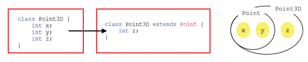
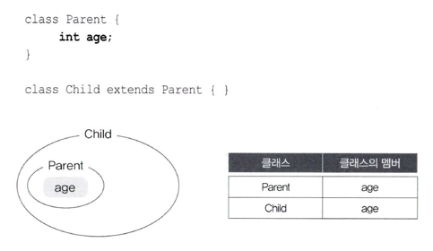

이 글은 저자 남궁성님의 ['자바의 정석'](<http://www.yes24.com/Product/Goods/24259565>)을 참고하여 작성하였습니다.

# 1. 객체지향언어
## 1-1. 객체지향언어의 역사

객체지향 언어는 주로 과학실험이나 미사일 발사실험과 같은 모의실험(simulation)의 목적으로 사용되었다.  
프로그램의 규모가 점점 커지고 빠르게 변화하는 사용자들의 요구를 절차적 언어로는 극복하기 힘들어졌고  
대안으로 객체지향 언어를 이용한 개발방법론이 떠올랐다.  

자바는 1995년에 발표되었고 인터넷의 발전괴 함께 크게 유행하면서 객체지향 언어는 프로그래밍의 주류로 자리 잡았다. 

## 1-2. 객체지향언어의 특징
- 기존의 프로그래밍 언어와 크게 다르지 않다.
  - 기존의 프로그래밍 언어에 몇가지 규칙을 추가한 것이다.


- 코드의 재사용성이 높다.
    - 새로운 코드를 작성할 때 기존의 코드를 이용하여 쉽게 작성할 수 있다..


- 코드의 관리가 용이하다.
  - 코드간의 관계를 이용해서 적은 노력으로 쉽게 코드를 변경할 수 있다.


- 신뢰성이 높은 프로그래밍을 가능하게 한다.
  - 제어자와 메서드를 이용해서 데이터를 보호하고 , 코드의 중복을 제거하여 코드의 불일치로 인한 오동작을 방지한다.


<br>

# 2. 클래스와 객체
```
클래스의 정의 : 클래스란 객체를 정의해 놓은 것이다.
클래스의 용도 : 클래스는 객체를 생성하는데 사용된다.
```
```
객체의 정의 : 실제로 존재하는 것. 사물 또는 개념
객체의 용도 : 객체가 가지고 있는 기능과 속성에 따라 다름
```






