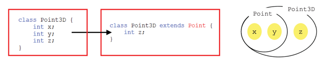
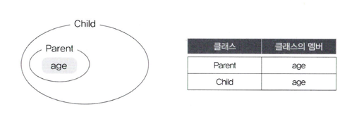

# 1. 상속
## 1-1 상속의 정의와 장점

상속이란, 기존의 클래스를 재사용하여 새로운 클래스를 작성하는 것이다.   
상속을 통해 클래스를 작성하면 보다 적은 양의 코드로 새로운 클래스를 작성할 수 있다.  

- 상속을 구현하는 법    
```java
class 자손클래스 extends 조상클래스 {
    //...
}
```
```java
class Child extends Panret {
    // Parent클래스를 상속받는 Child클래스 작성.
}
```
이 두 클래스는 서로 `상속 관계`에 있다고 하며, 상속해주는 클래스를 `조상 클래스`, 상속 받는 클래스를 `자손 클래스`라 한다.

```java
조상 클래스 : 부모클래스, 상위클래스, 기반클래스
자손 클래스 : 자식클래스, 하위클래스, 파생된클래스 
```



자손 클래스는 조상 클래스의 모든 멤버를 상속받기 때문에 Child클래스는 Parent클래스의 멤버들을 포함한다고 할 수 있다.  

만일 Parent클래스에 age라는 정수형 변수를 멤버변수로 추가하면, Child클래스는 자동적으로 age라는 멤버변수가 추가된 것과 같은 효과를 받는다. 

```java
class Parent {
    int age;
}

class Child extends Parent {  }
```


<br>

>생성자와 초기화 블럭은 상속되지 않는다. 멤버만 상속된다.   
> 자손 클래스의 멤버 개수는 조상 클래스보다 항상 같거나 많다.

>자손 클래스의 인스턴스를 생성하면 조상 클래스의 멤버와 자손 클래스의 멤버가 합쳐진 하나의 인스턴스로 생성된다.


<br>

## 1-2 클래스간의 관계 - 포함관계 
클래스 간의 `포함`관계를 맺어 주는 것은 한 클래스의 멤버변수로 다른 클래스 타입의 참조변수를 선언하는 것을 뜻한다. 

원을 표현하기 위한 Circle클래스를 작성하고 
```java
class Circle {
    int x;      // 원점의 x좌표
    int y;      // 원점의 y좌표
    int r;      // 반지름
}
```
그리고 좌표성의 한 점을 다루기 위한 Point클래스를 작성
```java
class Point {
    int x;     // x좌표
    int y;     // y좌표
}
```

여기서 Point클래스를 재사용해서 Circle클래스에 포함시킬 수 있다.
```java
class Circle {
    Point c = new Point();  // 원점
    int r;
}
```

## 1-3 클래스간의 관계 결정하기

- 상속, 포함 어떨 때 사용해야하나 ?
  -  '~은 이다(is a)'와 '~은 ~을 가지고 있다(has a)'를 넣어서 보면 클래스 간의 관계가 명확해 진다.

```java
원은 점이다 - Circle is a Point.
원은 점을 가지고 있다. - Circle has a Point.  // 더 자연스러운 문장
```

```java
상속관계 '~은 ~이다'
포함관계'~은 ~을 가지고 있다' 
```

<br>

## 1-4 단일 상속

자바에서는 오직 단일 상속만을 허용한다.   
단일 상속은 클래스 간의 관계가 보다 명확해지고 코드를 더욱 신뢰할 수 있게 만들어 준다는 점에서 다중상속보다 유리하다.
```java
class Tv {
    boolean power;
    int channel;

    void power() {power=!power;}
    void channelUp() {++channel;}
    void channelDown() {--channel;}
}

class VCR {
    boolean power;
    int counter = 0;
    void power() {power=!power;}
    void play() { /* 내용생략 */}
    void stop() { /* 내용생략 */}
    void rew() { /* 내용생략 */}
    void ff() { /* 내용생략 */}
}

class TVCR  extends Tv{
    VCR vcr = new VCR();  // VCR클래스를 포함시켜서 사용한다.

    void play() {
        vcr.play();
    }

    void stop() {
        vcr.stop();
    }

    void rew() {
        vcr.rew();
    }

    void ff() {
        vcr.ff();
    }
}
```

비중이 높은 클래스는 상속으로, 나머지는 포함관계로 한다. 

<br>

## 1-5. Object클래스 - 모든 클래스의 조상

- Object클래스는 모든 클래스 상속계층도의 최상위에 있는 조상클래스이다.   
- 조상이 없는 클래스는 자동적으로 Object클래스를 상속받게 된다.
- 모든 클래스는 Object클래스에 정의된 11개의 메서드를 상속받는다. toString(), equals(OBject obj), 등등...

-------------- 오브젝트 그림 넣기. 

<br>

## 2. 오버라이딩(overriding)

## 2-1 오버라이딩이란 ?

조상클래스로부터 `상속받은 메서드의 내용`을 상속받는 클래스에 맞게 `변경하는 것`을 오버라이딩이라고 한다. 

```java
class Point {
    int x;
    int y;
    
    String getLocation() {
        return "x :" + x + ", y :" + y;
    }
}

class Point3D extends Point {
    int z;
    String getLocation() {      // 오버라이딩. 
         return "x :" + x + ", y :" + y + ", z :" + z;
    }
}
```

<br>

## 2-2 오버라이딩의 조건

1. 선언부가 같아야 한다.(이름, 매개변수, 리턴타임)
2. 접근제어자를 좁은 범위로 변경할 수 없다.   <br>
조상의 메서드가 protected라면, 범위가 같거나 넓은 protected나 public으로만 변경할 수 있다.
3. 조상클래스의 메서드보다 많은 수의 예외를 선언할 수 없다. 


## 2-3 

```java
오버로딩  -  기존에 없는 새로운 메서드를 정의하는 것(new)
오버라이딩 -  상속받은 메서드의 내용을 변경하는 것
```
```java
class Parent {
    void parentMethod() {}
}

class Child extends Parent {
    void parentMethod() {}        // 오버라이딩
    void parentMethod(int i) {}   // 오버로딩 
  
    void childMethod() {}         
    void childMethod(int i){}    // 오버로딩
    void childMethod() {}        // 에러 ! 중복정의임. 
}
```

<br>

## 2-4 super - 참조변수

```java
this - 인스턴스 자신을 가리키는 참조변수. 인스턴스의 주소가 저장되어있음.
       모든 인스턴스 메서드에 지역변수로 숨겨진 채로 존재

super - this와 같음. 조상의 멤버와 자신의 멤버를 구별하는 데 사용. 
```
```java
class Point {
    int x;
    int y;
    
    String getLocation() {
        return "x :" + x + ", y :" + y;
    }
}

class Point3D extends Point {
    int z;
    String getLocation() {      // 오버라이딩.
        // return "x :" + x + ", y :" + y + ", z :" + z;
           return super.getLocation() + ", z :" + z;  // 조상의 메서드 호출. 
    }
}
```

<br>

## 2-5 super() - 조상의 생성자

- 자손클래스의 인스턴스를 생성하면, 자손의 멤버와 조상의 멤버가 합쳐진 하나의 인스턴스가 생성된다. 
- 조상의 멤버들도 초기화되어야 하기 때문에 자손의 생성자의 첫 문장에서 조상의 생성자를 호출해야 한다. 

```java
Object클래스를 제외한 모든 클래스의 생성자 첫 줄에는 생성자(같은 클래스의 다른 생성자 또는 조상의 생성자)를 호출해야한다.
그렇지 않으면 컴파일러가 자동적으로 'super();'를 생성자의 첫 줄에 삽입한다. 
```

------------super() 사진 넣기. 


<br>


-------- super() 2 사진 넣기. 


